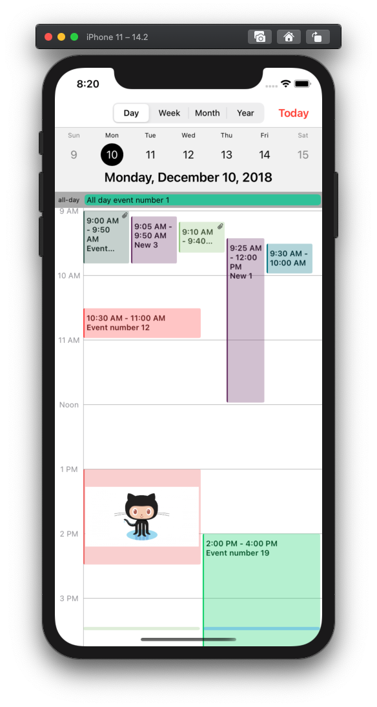
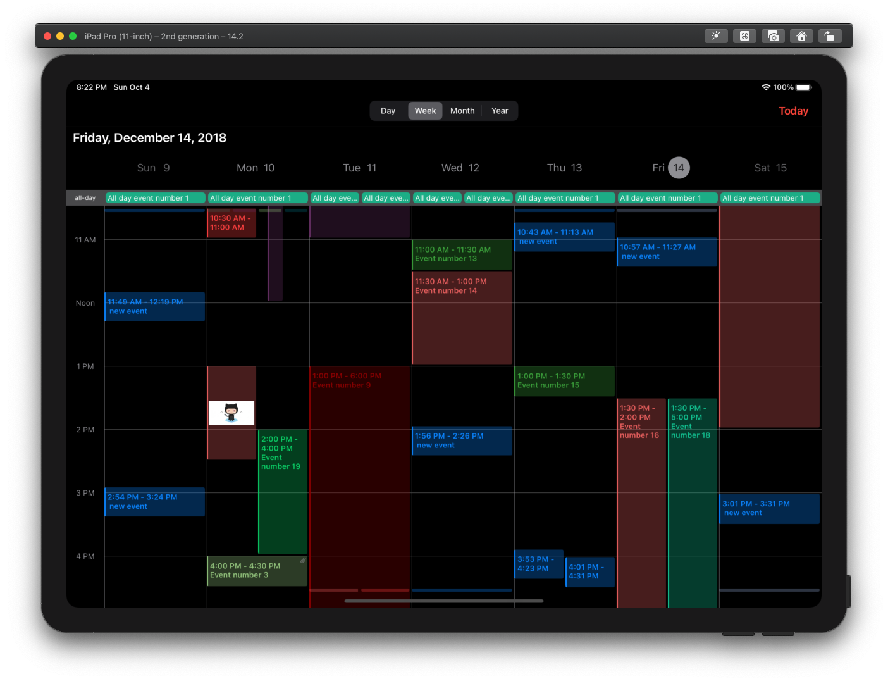

 

[](https://travis-ci.org/kvyatkovskys/KVKCalendar)
[](https://cocoapods.org/pods/KVKCalendar)
[](https://github.com/Carthage/Carthage/)
[](https://cocoapods.org/pods/KVKCalendar)
[](https://cocoapods.org/pods/KVKCalendar)

# KVKCalendar

**KVKCalendar** is a most fully customization calendar library. Library consists of four modules for displaying various types of calendar (*day*, *week*, *month*, *year*). You can choose any module or use all. It is designed based on a standard iOS calendar, but with additional features. Timeline displays the schedule for the day and week.

## Requirements

- iOS 10.0+
- MacOS 10.15+ (Supports Mac Catalyst)
- Swift 5.0+

## Installation

**KVKCalendar** is available through [CocoaPods](https://cocoapods.org) and [Carthage](https://github.com/Carthage/Carthage).

### CocoaPods
~~~bash
pod 'KVKCalendar'
~~~

### Carthage
~~~bash
github "kvyatkovskys/KVKCalendar"
~~~

## Usage for UIKit
Import `KVKCalendar`.
Create a subclass view `CalendarView` and implement `CalendarDataSource` protocol. Create an array of class `[Event]` and return this array in the function.

```swift
import KVKCalendar

class ViewController: UIViewController {
    var events = [Event]()

    override func viewDidLoad() {
        super.viewDidLoad()
        
        let calendar = CalendarView(frame: frame)
        calendar.dataSource = self
        view.addSubview(calendar)
        
        createEvents { (events) in
            self.events = events
            self.calendarView.reloadData()
        }
    }
}

extension ViewController {
    func createEvents(completion: ([Event]) -> Void) {
        let models = // Get events from storage / API
        var events = [Event]()
        
        for model in models {
            var event = Event()
            event.ID = model.id
            event.start = model.startDate // start date event
            event.end = model.endDate // end date event
            event.color = model.color
            event.isAllDay = model.allDay
            event.isContainsFile = !model.files.isEmpty
        
            // Add text event (title, info, location, time)
            if model.allDay {
                event.text = "\(model.title)"
            } else {
                event.text = "\(startTime) - \(endTime)\n\(model.title)"
            }
            events.append(event)
        }
        completion(events)
    }
}

extension ViewController: CalendarDataSource {
    func eventsForCalendar() -> [Event] {
        return events
    }
    
    // optional function
    // control style for specific date
    func willDisplayDate(_ date: Date?, events: [Event]) -> DateStyle? {
        // dates -> specific dates
        guard dates.first(where: { $0.year == date?.year && $0.month == date?.month && $0.day == date?.day }) != nil else { return nil }
        
        // DateStyle
        // - backgroundColor = cell background color
        // - textColor = cell text color
        // - dotBackgroundColor = selected date dot color
        return DateStyle(backgroundColor: .orange, textColor: .black, dotBackgroundColor: .red)
    }
}
```

Implement `CalendarDelegate` to handle user action and control calenadr behavior.

```swift
calendar.delegate = self

extension ViewController: CalendarDelegate {    
    func didSelectDate(_ date: Date?, type: CalendarType, frame: CGRect?) {}
    
    func didSelectEvent(_ event: Event, type: CalendarType, frame: CGRect?) {}
    
    func didSelectMore(_ date: Date, frame: CGRect?) {}
    
    func eventViewerFrame(_ frame: CGRect) {}
    
    func didChangeEvent(_ event: Event, start: Date?, end: Date?) {}
    
    func didAddEvent(_ date: Date?) {}
    
    func didDisplayEvents(_ events: [Event], dates: [Date?]) {}
}
```

To use a custom event view for specific event or date you need to create a new view of class `EventViewGeneral` and return the view in function.

```swift
class CustomViewEvent: EventViewGeneral {
    override init(style: Style, event: Event, frame: CGRect) {
        super.init(style: style, event: event, frame: frame)
    }
}

func willDisplayEventView(_ event: Event, frame: CGRect, date: Date?) -> EventViewGeneral? {
    return CustomEventView
}
```

## Usage for SwiftUI
Add a new `SwiftUI` file and import `KVKCalendar`.
Create a struct `CalendarDisplayView` and declare the protocol `UIViewRepresentable` for connection `UIKit` with `SwiftUI`.

```swift
import SwiftUI
import KVKCalendar

struct CalendarDisplayView: UIViewRepresentable {
    
    private var calendar: CalendarView = {
        return CalendarView(frame: frame, style: style)
    }()
        
    func makeUIView(context: UIViewRepresentableContext<CalendarDisplayView>) -> CalendarView {
        calendar.dataSource = context.coordinator
        calendar.delegate = context.coordinator
        calendar.reloadData()
        return calendar
    }
    
    func updateUIView(_ uiView: CalendarView, context: UIViewRepresentableContext<CalendarDisplayView>) {
        
    }
    
    func makeCoordinator() -> CalendarDisplayView.Coordinator {
        Coordinator(self)
    }
    
    // MARK: Calendar DataSource and Delegate
    class Coordinator: NSObject, CalendarDataSource, CalendarDelegate {
        private let view: CalendarDisplayView
        
        init(_ view: CalendarDisplayView) {
            self.view = view
            super.init()
        }
        
        func eventsForCalendar() -> [Event] {
            return events
        }
    }
}

struct CalendarDisplayView_Previews: PreviewProvider {
    static var previews: some View {
        CalendarDisplayView()
    }
}
```

Create a new `SwiftUI` file and add `CalendarDisplayView` to `body`.

```swift
import SwiftUI

struct CalendarContentView: View {    
    var body: some View {
        NavigationView {
            CalendarDisplayView()
        }
    }
}

struct CalendarContentView_Previews: PreviewProvider {
    static var previews: some View {
        CalendarContentView()
    }
}
```

## Styles
To customize calendar create an object `Style` and add to `init` class `CalendarView`.

```swift
public struct Style {
    public var event = EventStyle()
    public var timeline = TimelineStyle()
    public var week = WeekStyle()
    public var allDay = AllDayStyle()
    public var headerScroll = HeaderScrollStyle()
    public var month = MonthStyle()
    public var year = YearStyle()
    public var defaultType: CalendarType?
    public var timeHourSystem: TimeHourSystem = .twentyFourHour
    public var startWeekDay: StartDayType = .monday
    public var followInSystemTheme: Bool = false    
}
```

## Author

[Sergei Kviatkovskii](https://github.com/kvyatkovskys)

## License

KVKCalendar is available under the [MIT license](https://github.com/kvyatkovskys/KVKCalendar/blob/master/LICENSE.md)
