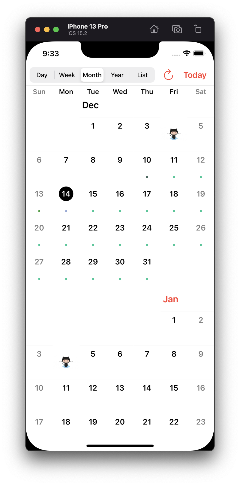

 

[](https://travis-ci.org/kvyatkovskys/KVKCalendar)
[](https://cocoapods.org/pods/KVKCalendar)
[](https://github.com/Carthage/Carthage/)
[](https://swiftpackageindex.com/kvyatkovskys/KVKCalendar)
[](https://cocoapods.org/pods/KVKCalendar)
[](https://cocoapods.org/pods/KVKCalendar)

# KVKCalendar

**KVKCalendar** is a most fully customization calendar. Library consists of five modules for displaying various types of calendar (*day*, *week*, *month*, *year*, *list of events*). You can choose any module or use all. It is designed based on a standard iOS calendar, but with additional features. Timeline displays the schedule for the day and the week.

**Additional features:**
- [x] Dark mode
- [ ] Skeleton loading (month/list)
- [x] Custom event view
- [x] Custom date cell
- [x] Custom header view and collection view
- [x] Custom calendar localization
- [x] Ability to set a divider line (day/week)
- [x] UIMenu supports in event view (iOS/Mac Catalyst 14.0 and above)
- [x] [Ability to configure the frame for viewing events](https://github.com/kvyatkovskys/KVKCalendar/pull/198)

## Need Help?

If you have a **question** about how to use KVKCalendar in your application, ask it on StackOverflow using the [KVKCalendar](https://stackoverflow.com/questions/tagged/kvkcalendar) tag.

Please, use [Issues](https://github.com/kvyatkovskys/KVKCalendar/issues) only for reporting **bugs** or requesting a new **features** in the library.

## Requirements

- iOS 10.0+, iPadOS 10.0+, MacOS 11.0+ (supports Mac Catalyst)
- Swift 5.0+

## Installation

**KVKCalendar** is available through [CocoaPods](https://cocoapods.org) or [Carthage](https://github.com/Carthage/Carthage) or [Swift Package Manager](https://swift.org/package-manager/).

### CocoaPods
~~~bash
pod 'KVKCalendar'
~~~

[Adding Pods to an Xcode project](https://guides.cocoapods.org/using/using-cocoapods.html)

### Carthage
~~~bash
github "kvyatkovskys/KVKCalendar"
~~~

[Adding Frameworks to an Xcode project](https://github.com/Carthage/Carthage#quick-start)

### Swift Package Manager (Xcode 12 or higher)

1. In Xcode navigate to **File** → **Swift Packages** → **Add Package Dependency...**
2. Select a project
3. Paste the repository URL (`https://github.com/kvyatkovskys/KVKCalendar.git`) and click **Next**.
4. For **Rules**, select **Version (Up to Next Major)** and click **Next**.
5. Click **Finish**.

[Adding Package Dependencies to Your App](https://developer.apple.com/documentation/swift_packages/adding_package_dependencies_to_your_app)

## Usage for UIKit

Import `KVKCalendar`.
Create a subclass view `CalendarView` and implement `CalendarDataSource` protocol. Create an array of class `[Event]` and return the array.

```swift
import KVKCalendar

class ViewController: UIViewController {
    var events = [Event]()

    override func viewDidLoad() {
        super.viewDidLoad()
        
        let calendar = CalendarView(frame: frame)
        calendar.dataSource = self
        view.addSubview(calendar)
        
        createEvents { (events) in
            self.events = events
            self.calendarView.reloadData()
        }
    }
    
    override func viewWillLayoutSubviews() {
        super.viewWillLayoutSubviews()
        // to track changing frame when an user rotates device
        calendarView.reloadFrame(view.frame)
    }
}

extension ViewController {
    func createEvents(completion: ([Event]) -> Void) {
        let models = // Get events from storage / API
        
        let events = models.compactMap({ (item) in
            var event = Event(ID: item.id)
            event.start = item.startDate // start date event
            event.end = item.endDate // end date event
            event.color = item.color
            event.isAllDay = item.allDay
            event.isContainsFile = !item.files.isEmpty
            event.recurringType = // recurring event type - .everyDay, .everyWeek
        
            // Add text event (title, info, location, time)
            if item.allDay {
                event.text = "\(item.title)"
            } else {
                event.text = "\(startTime) - \(endTime)\n\(item.title)"
            }
            return event
        })
        completion(events)
    }
}

extension ViewController: CalendarDataSource {
    func eventsForCalendar(systemEvents: [EKEvent]) -> [Event] {
        // if you want to get events from iOS calendars
        // set calendar names to style.systemCalendars = ["Test"]
        let mappedEvents = systemEvents.compactMap { Event(event: $0) }
        return events + mappedEvents
    }
}
```

Implement `CalendarDelegate` to handle user action and control calendar behaviour.

```swift
calendar.delegate = self
```

To use a custom view for specific event or date you need to create a new view of class `EventViewGeneral` and return the view in function.

```swift
class CustomViewEvent: EventViewGeneral {
    override init(style: Style, event: Event, frame: CGRect) {
        super.init(style: style, event: event, frame: frame)
    }
}

// an optional function from CalendarDataSource
func willDisplayEventView(_ event: Event, frame: CGRect, date: Date?) -> EventViewGeneral? {
    guard event.ID == id else { return nil }
    
    return customEventView
}
```


To use a custom date cell, just subscribe on this optional method from `CalendarDataSource` (works for Day/Week/Month/Year views).
```swift
func dequeueCell<T>(date: Date?, type: CalendarType, view: T, indexPath: IndexPath) -> KVKCalendarCellProtocol? where T: UIScrollView { 
    switch type {
    case .year:
        let cell = (view as? UICollectionView)?.dequeueCell(indexPath: indexPath) { (cell: CustomYearCell) in
            // configure the cell
        }
        return cell
    case .day, .week, .month:    
        let cell = (view as? UICollectionView)?.dequeueCell(indexPath: indexPath) { (cell: CustomDayCell) in
            // configure the cell
        }
        return cell
    case .list:    
        let cell = (view as? UITableView)?.dequeueCell { (cell: CustomListCell) in
            // configure the cell
        }
        return cell
    }
}
```


## Usage for SwiftUI

Add a new `SwiftUI` file and import `KVKCalendar`.
Create a struct `CalendarDisplayView` and declare the protocol `UIViewRepresentable` for connection `UIKit` with `SwiftUI`.

```swift
import SwiftUI
import KVKCalendar

struct CalendarDisplayView: UIViewRepresentable {
    @Binding var events: [Event]

    private var calendar: CalendarView = {
        return CalendarView(frame: frame, style: style)
    }()
        
    func makeUIView(context: UIViewRepresentableContext<CalendarDisplayView>) -> CalendarView {
        calendar.dataSource = context.coordinator
        calendar.delegate = context.coordinator
        calendar.reloadData()
        return calendar
    }
    
    func updateUIView(_ uiView: CalendarView, context: UIViewRepresentableContext<CalendarDisplayView>) {
        context.coordinator.events = events
    }
    
    func makeCoordinator() -> CalendarDisplayView.Coordinator {
        Coordinator(self)
    }
    
    public init(events: Binding<[Event]>) {
        self._events = events
    }
    
    // MARK: Calendar DataSource and Delegate
    class Coordinator: NSObject, CalendarDataSource, CalendarDelegate {
        private let view: CalendarDisplayView
        
        var events: [Event] = [] {
            didSet {
                view.calendar.reloadData()
            }
        }
        
        init(_ view: CalendarDisplayView) {
            self.view = view
            super.init()
        }
        
        func eventsForCalendar(systemEvents: [EKEvent]) -> [Event] {
            return events
        }
    }
}
```

Create a new `SwiftUI` file and add `CalendarDisplayView` to `body`.

```swift
import SwiftUI

struct CalendarContentView: View {
    @State var events: [Event] = []

    var body: some View {
        NavigationView {
            CalendarDisplayView(events: $events)
        }
    }
}
```

## Styles

To customize calendar create an object `Style` and add to `init` class `CalendarView`.

```swift
public struct Style {
    public var event = EventStyle()
    public var timeline = TimelineStyle()
    public var week = WeekStyle()
    public var allDay = AllDayStyle()
    public var headerScroll = HeaderScrollStyle()
    public var month = MonthStyle()
    public var year = YearStyle()
    public var list = ListViewStyle()
    public var locale = Locale.current
    public var calendar = Calendar.current
    public var timezone = TimeZone.current
    public var defaultType: CalendarType?
    public var timeHourSystem: TimeHourSystem = .twentyFourHour
    public var startWeekDay: StartDayType = .monday
    public var followInSystemTheme: Bool = false 
    public var systemCalendars: Set<String> = []
}
```

## Author

[Sergei Kviatkovskii](https://github.com/kvyatkovskys)

## License

KVKCalendar is available under the [MIT license](https://github.com/kvyatkovskys/KVKCalendar/blob/master/LICENSE.md)
